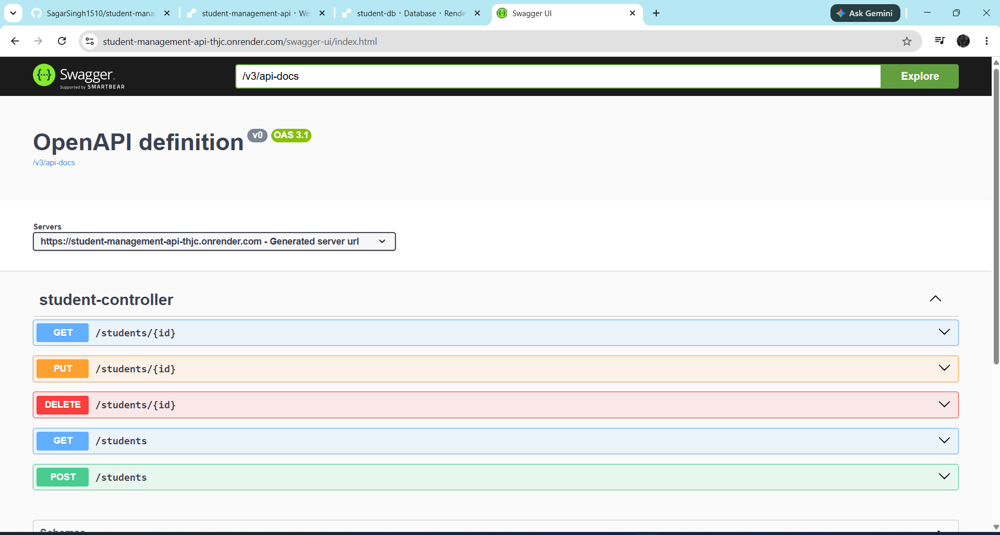
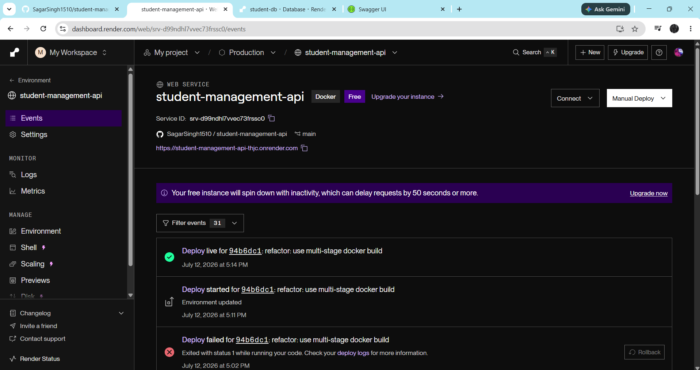

# 🎓 Student Management REST API


A production-ready RESTful Student Management API built using **Spring Boot**, **PostgreSQL**, and **Docker** following a layered architecture. The project demonstrates backend development concepts such as REST APIs, Spring Data JPA, Hibernate, validation, pagination, sorting, search, Docker containerization, and cloud deployment.

---

##  Live Demo

###  Live API

https://student-management-api-thjc.onrender.com

###  Swagger API Documentation

https://student-management-api-thjc.onrender.com/swagger-ui/index.html

---

##  Features

- ✅ Create, Read, Update and Delete Students
- ✅ PostgreSQL Database Integration
- ✅ Spring Data JPA & Hibernate ORM
- ✅ Bean Validation
- ✅ Pagination
- ✅ Sorting
- ✅ Search by Student Name
- ✅ RESTful API Design
- ✅ Docker & Docker Compose Support
- ✅ Cloud Deployment on Render
- ✅ Swagger/OpenAPI Documentation

---

##  Tech Stack

| Technology | Purpose |
|------------|----------|
| Java 21 | Programming Language |
| Spring Boot | Backend Framework |
| Spring Data JPA | ORM/Data Access |
| Hibernate | ORM Implementation |
| PostgreSQL | Database |
| Maven | Build Tool |
| Docker | Containerization |
| Docker Compose | Multi-container Development |
| Swagger/OpenAPI | API Documentation |
| Git & GitHub | Version Control |
| Render | Cloud Deployment |

---

##  Architecture

```
                Client
                   │
                   ▼
          StudentController
                   │
                   ▼
           StudentService
                   │
                   ▼
        StudentRepository
                   │
                   ▼
              PostgreSQL
```

The application follows a layered architecture where each layer has a single responsibility.

- **Controller** → Handles HTTP requests and responses
- **Service** → Contains business logic
- **Repository** → Performs database operations using Spring Data JPA
- **Database** → PostgreSQL

---

##  Project Structure

```
src
└── main
    └── java
        └── com.sagar.student_management_api
            ├── controller
            ├── dto
            ├── mapper
            ├── model
            ├── repository
            ├── service
            └── StudentManagementApiApplication
```

---

##  REST API Endpoints

| Method | Endpoint | Description |
|---------|----------|-------------|
| GET | `/students` | Get all students |
| GET | `/students/{id}` | Get student by ID |
| POST | `/students` | Add a new student |
| PUT | `/students/{id}` | Update student |
| DELETE | `/students/{id}` | Delete student |

### Pagination

```
GET /students?page=0&size=5
```

### Sorting

```
GET /students?sortField=name&direction=asc
```

### Search

```
GET /students?name=Sagar
```

---

##  Running Locally

Clone the repository

```bash
git clone https://github.com/SagarSingh1510/student-management-api.git
```

Move into the project

```bash
cd student-management-api
```

Build

```bash
mvn clean package
```

Run

```bash
mvn spring-boot:run
```

---

##  Running with Docker

Build

```bash
docker build -t student-api .
```

Run

```bash
docker run -p 8080:8080 student-api
```

Or use Docker Compose

```bash
docker compose up
```

---

##  Deployment

The application is deployed on **Render** with a managed **PostgreSQL** database.

Live API:

https://student-management-api-thjc.onrender.com

Swagger:

https://student-management-api-thjc.onrender.com/swagger-ui/index.html

##  Screenshots

### Swagger UI



---

### Get Students


---

### Create Student


---

### Render Deployment



---

##  Future Improvements

- Spring Security
- JWT Authentication
- Role-Based Authorization
- Unit Testing
- Redis Caching
- CI/CD Pipeline
- Logging & Monitoring

---

##  Author

**Sagar Singh**

GitHub: https://github.com/SagarSingh1510